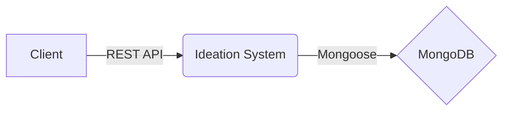

<p align="center">
  <a href="http://https://www.qmarkets.net//" target="blank"></a>
</p>

  <p align="center">A backend ideation system.</p>
    <p align="center">

## Description

Using this system, Users can submit ideas to the system and be able to read them.

The system core stack is Node.js, TypeScript, NestJS, and MongoDB.

## Overview of the architecture



The ideation system, which is bulit with NestJS, exposes a REST API (Documentation available at http://localhost:3000/api).
All the ideas are saved in a MongoDB (Using `@nestjs/mongoose`).

## Project setup

```bash
$ npm install
```

## Compile and run the project

```bash
# development
$ npm run start

# watch mode
$ npm run start:dev

# production mode
$ npm run start:prod
```

## Run tests

```bash
# unit tests
$ npm run test

# e2e tests
$ npm run test:e2e

# test coverage
$ npm run test:cov
```

## Run using docker-compose
```bash
# all components
$ docker-compose -f docker-compose-all.yaml up -d

# Only system dependencies
$ docker-compose -f docker-compose-dependencies.yaml up -d
```
